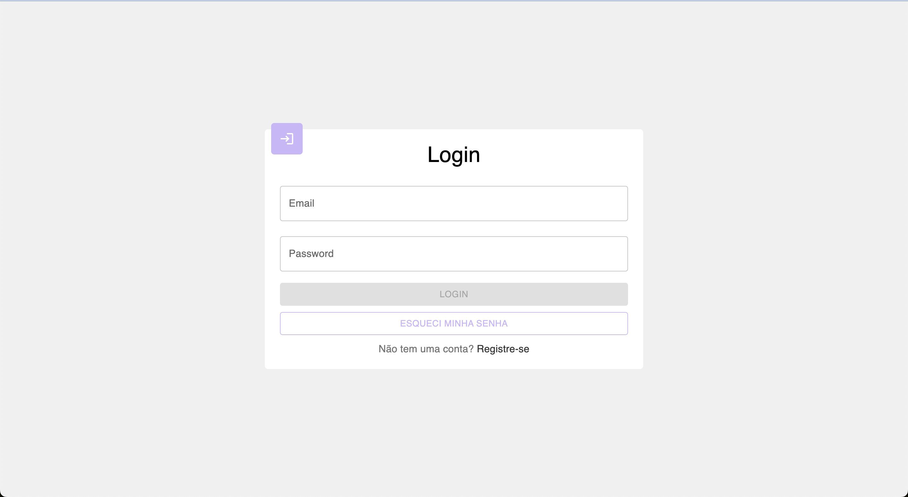
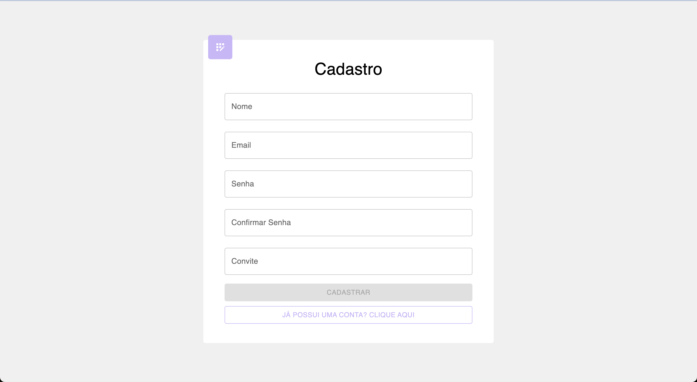
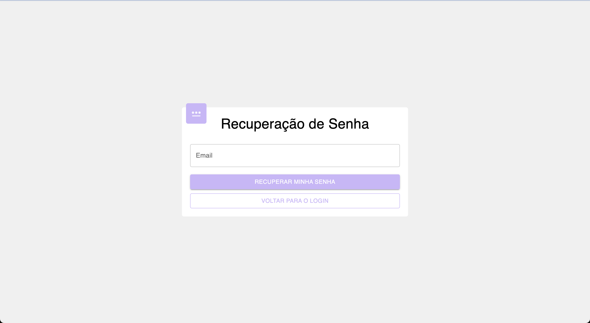
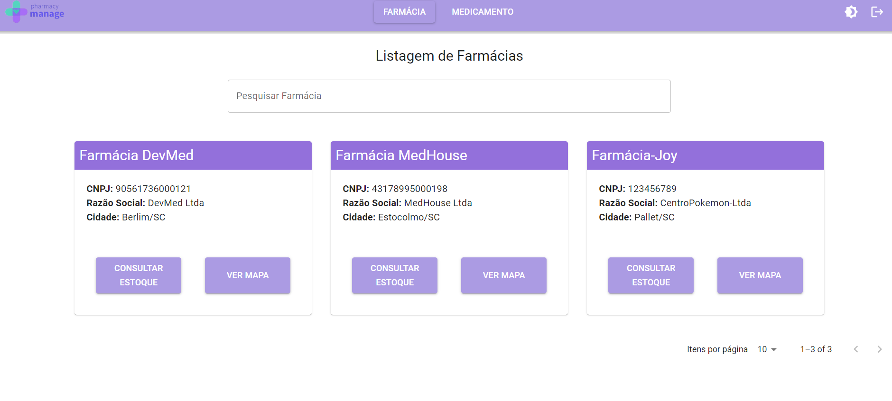
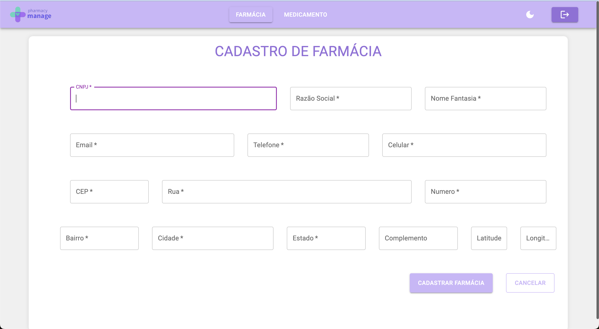
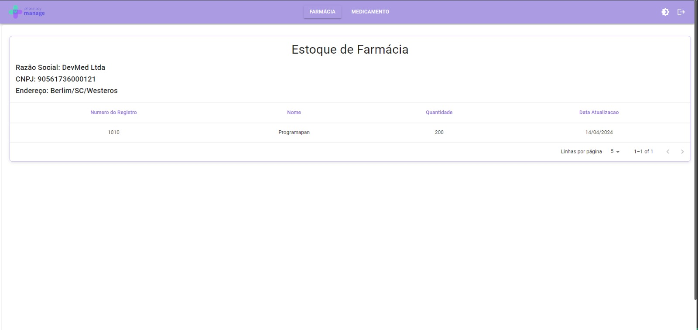
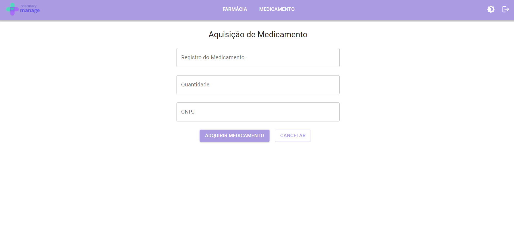
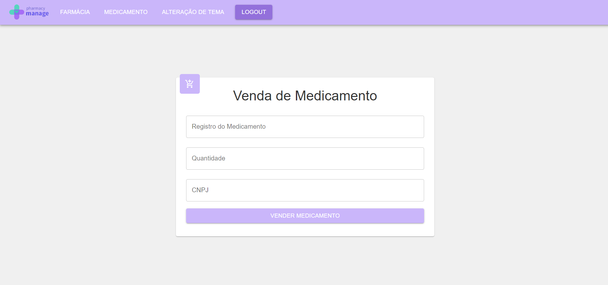
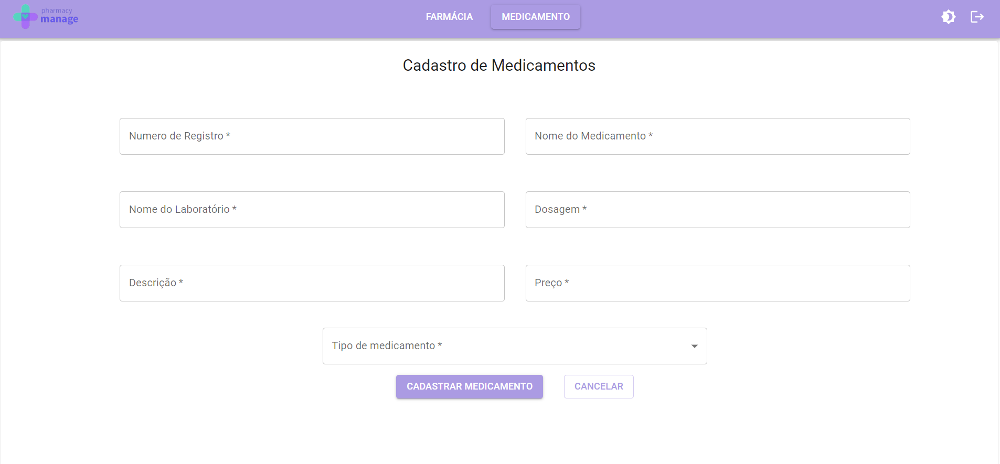
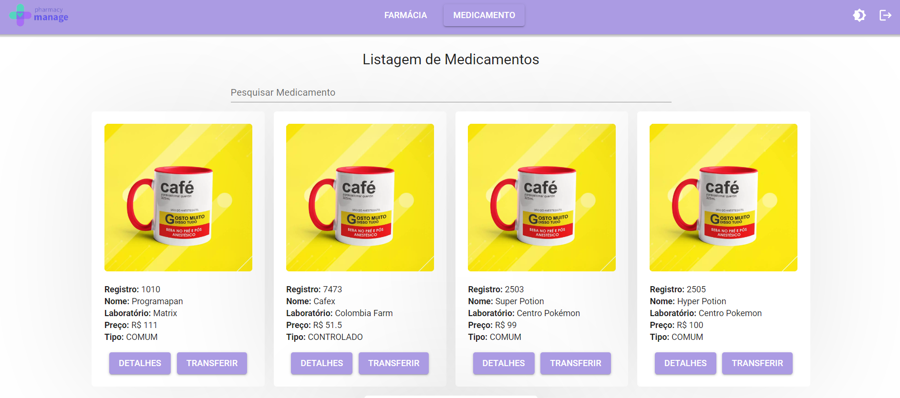

<h1 align="center">PharmacyManage</h1>

<p align="center">
  <a href="#-tecnologias">Tecnologias</a>&nbsp;&nbsp;&nbsp;|&nbsp;&nbsp;&nbsp;
  <a href="#-projeto">Projeto</a>&nbsp;&nbsp;&nbsp;|&nbsp;&nbsp;&nbsp;
  <a href="#-layout">Layout</a>&nbsp;&nbsp;&nbsp;
</p>

## 🚀 Tecnologias

Esse projeto foi desenvolvido com as seguintes tecnologias:

| Tecnologia                                                                                                           | Funcionalidade                                                                                                                              |
|----------------------------------------------------------------------------------------------------------------------|---------------------------------------------------------------------------------------------------------------------------------------------|
|             | para criar interatividade e interfaces de usuário dinâmicas, permitindo o cadastro e acesso eficiente aos dados. |
|  | para compilação e desenvolvimento.                                                              |
|                   | versionamento de código em repositório local.                                                                                               |
|          | versionamento de código em repositório remoto.                                                                                              | 


## 💻 Projeto

O presente trabalho foi desenvolvido durante o módulo final do curso DevInHouse, Turma Clamed V2 e consiste em **uma aplicação web para cadastro e controle de farmácias e medicamentos**. A seguir estão listadas algumas das funcionalidades da aplicação:

- [x] Cadastro de usuário
- [x] Tela de login e validação
- [x] Botão Esqueci minha senha
- [x] Cadastro de medicamentos
- [x] Cadastro de farmácias
- [x] Mapa de localização das farmácias
- [x] Header com menu de navegação

## 🔖 Layout

Para implementação das funcionalidades foram desenvolvidas as seguintes páginas:

### 1. Login de Usuário
Permite realizar autenticação de usuário através de email e senha para acesso a aplicação.
<p align="center">
  
</p>

### 2. Cadastro de Usuário
Utilizado para registrar email e senha escolhida pelo usuário.
<p align="center">
  
</p>

### 3. Esqueci Senha
Página para recuperação de senha.
<p align="center">
  
</p>

### 4. Listagem de Farmácias
Exibe listagem paginadas das farmácias cadastradas.
<p align="center">
  
</p>

### 5. Cadastro de Farmácia
Página para cadastro de uma nova farmácia, realiza consulta do CEP inserido e preenchimento automático do endereço através do serviço [Via CEP](https://viacep.com.br/).
<p align="center">
  
</p>

### 6. Estoque de Farmácia
Exibe os medicamentos cadastrados em determinada farmácias, bem como duas quantidades.
<p align="center">
  
</p>

### 7. Aquisição de Medicamento
Página de formulário para realizar aquisição de um medicamento. 
<p align="center">
  
</p>

### 8. Venda de Medicamento
Página de formulário para realizar venda de um medicamento. 
<p align="center">
  
</p>

### 9. Cadastro de Medicamentos
Página de formulário para realizar registro de um novo medicamento. 
<p align="center">
  
</p>

### 10. Listagem de Medicamentos
Exibe os medicamentos cadastrados com com informações detalhadas.
<p align="center">
  
</p>

## 🏃 Iniciando o Projeto
Primeiro clone este repositório remoto em sua máquina local:

[https://github.com/DEVinHouse-Clamed-V2/M3P-FrontEnd-Squad4](https://github.com/DEVinHouse-Clamed-V2/M3P-FrontEnd-Squad4)

Lembre-se de adicionar as dependências do projeto:

```bash
npm install
# ou
yarn install
```

Inicie o servidor de desenvolvimento:
```bash
npm run dev
# ou
yarn run dev
```

Acesse [http://localhost:5173/](http://localhost:5173/) com seu navegador para acessar a aplicação.

## 📝 Equipe
<p>Esse projeto foi desenvolvido pelo grupo DevSync.</p>

| Desnvolvedores | Github |
| ---            | ---    |
| Camila Artigas De Pra | camilartigas |
| Denison Perin Kolling | denisonkolling |
| Fernanda Ribeiro Coutinho | feecoutinho |
| Jader Luiz Maciel Do Nascimento | jaderm1 |
| Lucas Vinicius Damasceno Alves | Lucasvdalves |
| Maria Nilda Vicente Caetano | mavicaetano |